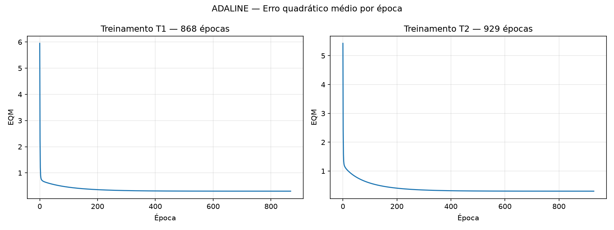

# Lab. Inteligência Artificial — Perceptron e ADALINE

CEFET-MG Campus VIII – Varginha · Prof. Lázaro Eduardo da Silva · 01/10/2026

**Aluno(a):** ______________________________

Os resultados numéricos abaixo foram gerados por `perceptron.py` e `adaline.py`. Em cada
treinamento o gerador de números aleatórios é reiniciado com uma semente diferente
(`random.seed(1)` … `random.seed(5)`), de modo que os pesos iniciais são distintos entre si e
os resultados são reproduzíveis.

---

## Parte 1 — Perceptron (classificação de pureza do óleo)

Regra de Hebb: `w ← w + η·(d − y)·x`, com η = 0,01, `x0 = −1`, função de ativação sinal.
O treinamento termina quando uma época inteira passa sem nenhum erro de classificação.

### Questão 2 — Resultados dos 5 treinamentos

| Treinamento | w0 ini | w1 ini | w2 ini | w3 ini | w0 fin | w1 fin | w2 fin | w3 fin | Épocas |
|---|---|---|---|---|---|---|---|---|---|
| 1º (T1) | 0.1344 | 0.8474 | 0.7638 | 0.2551 | -3.1656 | 1.5906 | 2.5320 | -0.7509 | 435 |
| 2º (T2) | 0.9560 | 0.9478 | 0.0566 | 0.0849 | -3.0640 | 1.5545 | 2.4773 | -0.7324 | 419 |
| 3º (T3) | 0.2380 | 0.5442 | 0.3700 | 0.6039 | -2.9220 | 1.4417 | 2.3947 | -0.6806 | 336 |
| 4º (T4) | 0.2360 | 0.1032 | 0.3961 | 0.1550 | -2.9240 | 1.4186 | 2.4104 | -0.7001 | 345 |
| 5º (T5) | 0.6229 | 0.7418 | 0.7952 | 0.9425 | -3.0571 | 1.5673 | 2.4640 | -0.7304 | 413 |

### Questão 3 — Classificação das amostras (−1 = C1, +1 = C2)

| Amostra | x1 | x2 | x3 | y (T1) | y (T2) | y (T3) | y (T4) | y (T5) |
|---|---|---|---|---|---|---|---|---|
| 1 | -0.3565 | 0.0620 | 5.9891 | -1 | -1 | -1 | -1 | -1 |
| 2 | -0.7842 | 1.1267 | 5.5912 | +1 | +1 | +1 | +1 | +1 |
| 3 | 0.3012 | 0.5611 | 5.8234 | +1 | +1 | +1 | +1 | +1 |
| 4 | 0.7757 | 1.0648 | 8.0677 | +1 | +1 | +1 | +1 | +1 |
| 5 | 0.1570 | 0.8028 | 6.3040 | +1 | +1 | +1 | +1 | +1 |
| 6 | -0.7014 | 1.0316 | 3.6005 | +1 | +1 | +1 | +1 | +1 |
| 7 | 0.3748 | 0.1536 | 6.1537 | -1 | -1 | -1 | -1 | -1 |
| 8 | -0.6920 | 0.9404 | 4.4058 | +1 | +1 | +1 | +1 | +1 |
| 9 | -1.3970 | 0.7141 | 4.9263 | -1 | -1 | -1 | -1 | -1 |
| 10 | -1.8842 | -0.2805 | 1.2548 | -1 | -1 | -1 | -1 | -1 |

### Questão 4 — Por que o número de épocas varia a cada treinamento?

Porque o vetor de pesos inicial é sorteado aleatoriamente a cada execução. O perceptron
parte de um hiperplano de separação diferente em cada treinamento e, a cada padrão
classificado errado, desloca esse hiperplano em um passo fixo (η·(d − y)·x). A quantidade
de correções necessárias até que **todos** os padrões fiquem do lado correto depende de
quão longe o hiperplano inicial está de uma região de solução e da sequência de erros
que ocorre pelo caminho — e isso muda com cada ponto de partida.

Além disso, quando as classes são linearmente separáveis existem **infinitos** hiperplanos
que as separam. O perceptron para no primeiro que encontrar (erro zero), não em um
hiperplano "ótimo" único; por isso tanto o número de épocas (336 a 435 aqui) quanto os
pesos finais diferem levemente entre os treinamentos. Neste conjunto a faixa de soluções
é estreita (as classes ficam muito próximas), o que explica tanto o número elevado de
épocas quanto a semelhança entre os pesos finais.

### Questão 5 — Principal limitação do perceptron

O perceptron de camada única só consegue resolver problemas **linearmente separáveis**:
sua fronteira de decisão é sempre um hiperplano (uma reta em 2D, um plano em 3D). Se não
existir um hiperplano que separe perfeitamente as classes — como no clássico problema do
**OU-exclusivo (XOR)** — a regra de Hebb nunca chega a uma época sem erros e o
treinamento não converge, ficando oscilando indefinidamente (na prática é preciso impor
um número máximo de épocas). Para fronteiras não lineares é necessário usar redes com
múltiplas camadas (Perceptron Multicamadas treinado por *backpropagation*).

Uma limitação secundária é que, mesmo em problemas separáveis, a solução encontrada é
apenas *uma* das possíveis, não necessariamente a que melhor generaliza, e o perceptron
é sensível a ruídos próximos à fronteira.

---

## Parte 2 — ADALINE (roteamento de sinais para as válvulas A e B)

Regra Delta: `w ← w + η·(d − u)·x`, com η = 0,0025, `x0 = −1`, onde `u` é a saída linear
(antes da função sinal). O erro quadrático médio é
`EQM = (1/p)·Σ (d − u)²` e o treinamento termina quando
`|EQM_atual − EQM_anterior| ≤ ε`, com ε = 10⁻⁶.

### Questão 2 — Resultados dos 5 treinamentos

| Treinamento | w0 ini | w1 ini | w2 ini | w3 ini | w4 ini | w0 fin | w1 fin | w2 fin | w3 fin | w4 fin | Épocas |
|---|---|---|---|---|---|---|---|---|---|---|---|
| 1º (T1) | 0.1344 | 0.8474 | 0.7638 | 0.2551 | 0.4954 | -1.8131 | 1.3129 | 1.6423 | -0.4277 | -1.1778 | 868 |
| 2º (T2) | 0.9560 | 0.9478 | 0.0566 | 0.0849 | 0.8355 | -1.8131 | 1.3129 | 1.6423 | -0.4277 | -1.1778 | 929 |
| 3º (T3) | 0.2380 | 0.5442 | 0.3700 | 0.6039 | 0.6257 | -1.8130 | 1.3129 | 1.6423 | -0.4276 | -1.1778 | 903 |
| 4º (T4) | 0.2360 | 0.1032 | 0.3961 | 0.1550 | 0.0665 | -1.8131 | 1.3128 | 1.6422 | -0.4278 | -1.1777 | 878 |
| 5º (T5) | 0.6229 | 0.7418 | 0.7952 | 0.9425 | 0.7399 | -1.8131 | 1.3129 | 1.6424 | -0.4275 | -1.1778 | 924 |

EQM final em todos os treinamentos ≈ 0,3020. Acerto no conjunto de treinamento: 32/35.

### Questão 3 — EQM em função das épocas (T1 e T2)

Nas primeiras épocas o EQM cai bruscamente (de ≈ 6 para ≈ 1); depois a descida fica
cada vez mais lenta até estabilizar em ≈ 0,302, quando a variação entre épocas fica
abaixo de 10⁻⁶.

### Questão 4 — Classificação dos sinais (−1 = válvula A, +1 = válvula B)

| Amostra | x1 | x2 | x3 | x4 | y (T1) | y (T2) | y (T3) | y (T4) | y (T5) |
|---|---|---|---|---|---|---|---|---|---|
| 1 | 0.9694 | 0.6909 | 0.4334 | 3.4965 | -1 (A) | -1 (A) | -1 (A) | -1 (A) | -1 (A) |
| 2 | 0.5427 | 1.3832 | 0.6390 | 4.0352 | -1 (A) | -1 (A) | -1 (A) | -1 (A) | -1 (A) |
| 3 | 0.6081 | -0.9196 | 0.5925 | 0.1016 | +1 (B) | +1 (B) | +1 (B) | +1 (B) | +1 (B) |
| 4 | -0.1618 | 0.4694 | 0.2030 | 3.0117 | -1 (A) | -1 (A) | -1 (A) | -1 (A) | -1 (A) |
| 5 | 0.1870 | -0.2578 | 0.6124 | 1.7749 | -1 (A) | -1 (A) | -1 (A) | -1 (A) | -1 (A) |
| 6 | 0.4891 | -0.5276 | 0.4378 | 0.6439 | +1 (B) | +1 (B) | +1 (B) | +1 (B) | +1 (B) |
| 7 | 0.3777 | 2.0149 | 0.7423 | 3.3932 | +1 (B) | +1 (B) | +1 (B) | +1 (B) | +1 (B) |
| 8 | 1.1498 | -0.4067 | 0.2469 | 1.5866 | +1 (B) | +1 (B) | +1 (B) | +1 (B) | +1 (B) |
| 9 | 0.9325 | 1.0950 | 1.0359 | 3.3591 | +1 (B) | +1 (B) | +1 (B) | +1 (B) | +1 (B) |
| 10 | 0.5060 | 1.3317 | 0.9222 | 3.7174 | -1 (A) | -1 (A) | -1 (A) | -1 (A) | -1 (A) |
| 11 | 0.0497 | -2.0656 | 0.6124 | -0.6585 | -1 (A) | -1 (A) | -1 (A) | -1 (A) | -1 (A) |
| 12 | 0.4004 | 3.5369 | 0.9766 | 5.3532 | +1 (B) | +1 (B) | +1 (B) | +1 (B) | +1 (B) |
| 13 | -0.1874 | 1.3343 | 0.5374 | 3.2189 | -1 (A) | -1 (A) | -1 (A) | -1 (A) | -1 (A) |
| 14 | 0.5060 | 1.3317 | 0.9222 | 3.7174 | -1 (A) | -1 (A) | -1 (A) | -1 (A) | -1 (A) |
| 15 | 1.6375 | -0.7911 | 0.7537 | 0.5515 | +1 (B) | +1 (B) | +1 (B) | +1 (B) | +1 (B) |

Observação: as amostras 10 e 14 são idênticas no enunciado, por isso recebem sempre a
mesma classe.

### Questão 5 — Por que os pesos finais ficam praticamente iguais, mesmo com número de épocas diferente?

Porque o ADALINE não busca "qualquer" hiperplano que separe as classes (como o
perceptron), e sim o vetor de pesos que **minimiza o erro quadrático médio** entre a
saída linear `u` e o valor desejado `d`. Como `u = wᵀx` é linear nos pesos, o EQM é uma
função **quadrática** de `w`: sua superfície de erro é um paraboloide (uma "tigela")
com **um único mínimo global** — a solução de mínimos quadrados, determinada apenas pelo
conjunto de treinamento.

A Regra Delta é uma descida pelo gradiente nessa superfície. Independentemente do ponto
de partida (pesos iniciais aleatórios), a descida sempre converge para o mesmo mínimo
`w*`. O que muda de um treinamento para outro é apenas a **trajetória** e a distância
inicial até `w*`: pontos de partida mais distantes (ou em direções onde a superfície é
mais "plana") exigem mais épocas até que a variação do EQM fique abaixo de ε = 10⁻⁶. Por
isso o número de épocas varia (868 a 929), mas os pesos finais coincidem até a 3ª/4ª casa
decimal — as pequenas diferenças restantes vêm apenas do critério de parada por
precisão, que interrompe a descida um pouco antes do mínimo exato.
